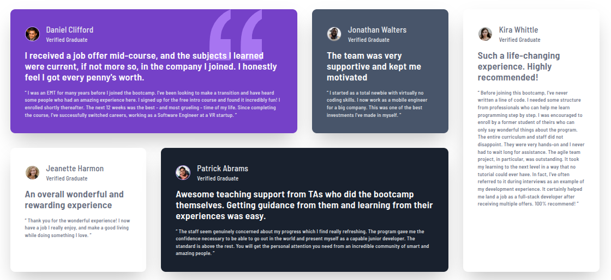
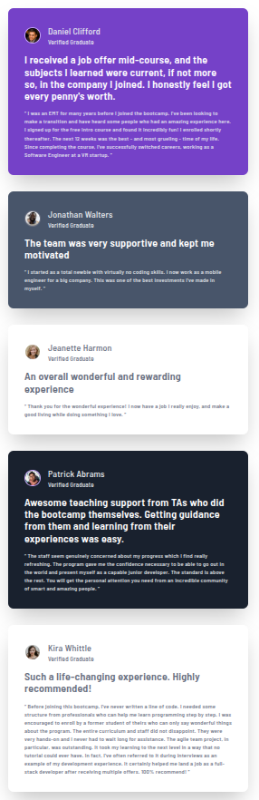

# Frontend Mentor - Testimonials grid section solution

This is a solution to the [Testimonials grid section challenge on Frontend Mentor](https://www.frontendmentor.io/challenges/testimonials-grid-section-Nnw6J7Un7). Frontend Mentor challenges help you improve your coding skills by building realistic projects. 

## Table of contents

- [Overview](#overview)
  - [The challenge](#the-challenge)
  - [Screenshot](#screenshot)
  - [Links](#links)
- [My process](#my-process)
  - [Built with](#built-with)
  - [What I learned](#what-i-learned)
- [Author](#author)

## Overview

### The challenge

Users should be able to:

- View the optimal layout for the site depending on their device's screen size

### Screenshot





### Links

- [Github Repository](https://github.com/ffrosch/frontendmentor-testimonials-grid-section)
- [Live URL](https://ffrosch.github.io/frontendmentor-testimonials-grid-section/)

## My process

### Initial setup

Install dependencies (make sure you are already in your project folder!)

```shell
bun create vite . --template vue-ts
# Typescript must be a peer dependency to enable
# import and usage of types in Vue defineProps function
bun remove typescript && bun add --peer typescript
bun add tailwindcss
bun add -d @tailwindcss/vite @vue/tsconfig
bun install
```

Modify `"scripts"` in `package.json` to look like this

```json
{
  "scripts": {
    "dev": "bunx --bun vite",
    "build": "bunx --bun vue-tsc -b && bunx --bun vite build",
    "preview": "bunx --bun vite preview"
  }
}
```

Adjust `vite.config.js` to this

```ts
import { defineConfig } from "vite";
import vue from "@vitejs/plugin-vue";
import tailwindcss from "@tailwindcss/vite";

// https://vite.dev/config/
export default defineConfig({
  resolve: {
    alias: {
      "@": "/src",
    },
  },
  base: '/<project-name>/',
  plugins: [
    vue(),
    tailwindcss()
  ],
});
```

Add fonts and tailwind as well as your basic theme to `src/style.css`

```css
@import url("https://fonts.googleapis.com/css2?family=Barlow+Semi+Condensed:wght@500;600&display=swap");
@import "tailwindcss";

@theme {
  --color-primary--50: hsl(260, 100%, 95%);
  --color-primary--300: hsl(264, 82%, 80%);
  --color-primary--500: hsl(263, 55%, 52%);

  --color-neutral-white: hsl(0, 0%, 100%);
  --color-neutral-grey-100: hsl(214, 17%, 92%);
  --color-neutral-grey-200: hsl(0, 0%, 81%);
  --color-neutral-grey-400: hsl(224, 10%, 45%);
  --color-neutral-grey-500: hsl(217, 19%, 35%);
  --color-neutral-darkblue: hsl(219, 29%, 14%);
  --color-neutral-black: hsl(0, 0%, 7%);

  --text-xs: 0.8125rem;
  --font-barlow: "Barlow Semi Condensed", sans-serif;
}

body {
  font-size: var(--text-xs);
  font-family: var(--font-barlow);
}

a {
  color: var(--color-blue-400);
  text-decoration: underline;
}

a:hover {
  color: var(--color-blue-500);
  font-weight: var(--font-weight-semibold);
}
```

### Built with

Tech Stack: Bun, Vite, Vue, Typescript, Tailwind

- Mobile-first workflow
- Tailwind custom theme
- CSS Grid
- [Vue](https://vuejs.org/) - JS library
- [Vite](https://vite.dev/) - Build tool
- [Typescript](https://www.typescriptlang.org/) - Type Safety
- [Tailwind](https://tailwindcss.com/) - CSS framework

### What I learned

Tailwind 4 combined with the "Tailwind CSS Intellisense" extension for VS Code makes styling and creating custom utility classes a breeze. Such a delight!
Using Bun and Vue for such a small project is overkill for sure, but it's great to get more practice in quickly setting up a development environment.

This project really helped me to get more experience with CSS Grid.

## Author

- Website - [florianfrosch.de](https://florianfrosch.de/)
- Frontend Mentor - [@ffrosch](https://www.frontendmentor.io/profile/ffrosch)
